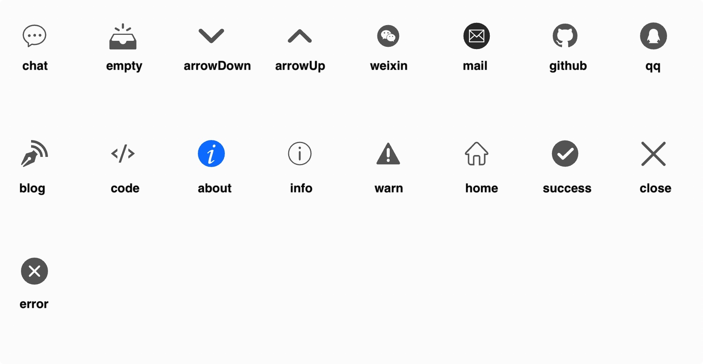
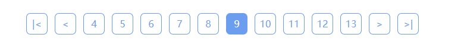
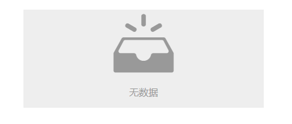
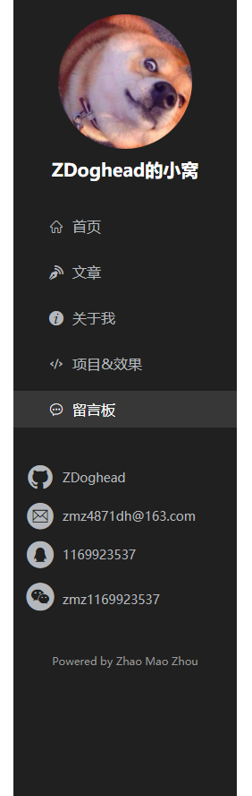
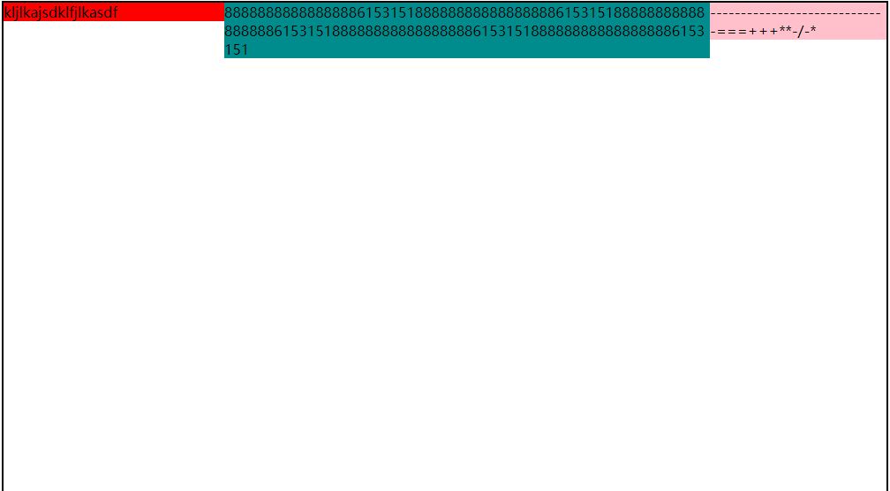

# Avatar


## 属性

| 属性名 | 含义              | 类型   | 必填  | 默认值 |
| -----  | ---------------- | ------ | ----- | ---- |
| url    | 图片地址          | String | 是    | 无   |
| size   | 图片尺寸，宽高相对 | Number | 否    | 150  |


# Icon


图标组件

使用的图标源来自于「阿里巴巴矢量库」

## 属性

| 属性名 | 含义     | 类型   | 必填 | 默认值 |
| ------ | -------- | ------ | ---- | ------ |
| type   | 图标类型 | String | 是   | 无     |

有效的图标类型：




# Pager



## 属性

| 属性名        | 含义       | 类型    | 必填 | 默认值 |
| ------------- | ---------- | ------ | ---- | ---- |
| current       | 当前页码   | Number | 否  | 1     |
| total         | 总的数据量 | Number | 否  | 0     |
| limit         | 页容量     | Number | 否  | 10    |
| visibleNumber | 可见页码数 | Number | 否  | 10    |

## 事件

| 事件名     | 含义     | 事件参数 | 参数类型 |
| ---------- | ------- | ------- | ------ |
| pageChange | 改变页码 | newPage | Number |

# Empty



## 属性

| 属性名 | 含义       | 类型   | 必填 | 默认值   |
| ------ | --------- | ------ | ---- | ------- |
| text   | 显示的文字 | String | 否   | "无数据" |

# ImageLoader


## 属性

| 属性名      | 含义                                    | 类型   | 必填 | 默认值 |
| ----------- | -------------------------------------- | ------ | --- | ---- |
| src         | 原始图片路径                            | String | 是  | 无   |
| placeholder | 原始图片加载完成之前的占位图              | String | 是  | 无   |
| duration    | 原始图片加载完成后，切换到原始图片的毫秒数 | Number | 否  | 500  |

## 事件

| 事件名     | 含义              | 事件参数 | 参数类型 |
| ---------- | ---------------- | ------- | -------- |
| load       | 原始图加载完后触发 | 无      | 无       |


# SiteAside



网站侧边栏

宽度和高度撑满父容器

# Layout



布局分为左、中、右三栏布局，某些时候会出现两栏布局

使用实例：
```html
<Layout>
  <template v-slot:left>
    <div class="left">左侧边栏</div>
  </template>
  <div class="main">中间主区域</div>
  <template v-slot:right>
    <div class="right">右侧边栏</div>
  </template>
</Layout>
```

## 插槽

| 插槽名  | 含义       |
| ------- | --------- |
| default | 中间主区域 |
| left    | 左侧边栏   |
| right   | 右侧边栏   |